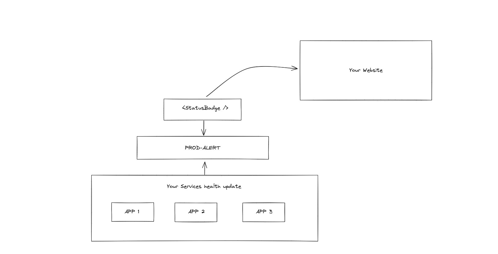

# 🟢 prod-alert

A React component to display the real-time health status of your application, beautifully and easily. The component shows green, red, gray status badge depending on service status.

Designed for plug-and-play use with **Next.js**, **Vite**, or any React-based frontend. Can be added to server components via client wrapper which is installed through below CLI.




---

## 🚀 Installation

First run
```bash
npm install prod-alert-react
```

---

## 💡 Usage

### 🔁 Next.js App Router (Client Component)

```tsx
'use client';

import { StatusBadge } from 'prod-alert-react';

export default function Header() {
  return <StatusBadge appId="your-app-id" label />;
}
```

### 🔁 Next.js App Router (Server Component)

Next.js does not allow using React hooks from a Server Component, so wrap it in a client component.

You can generate this wrapper with our CLI:  
```bash
npx prod-alert
```

Or manually:

```tsx
// src/components/HealthStatusBadge.tsx
'use client';

import dynamic from 'next/dynamic';

const HealthStatusBadge = dynamic(() =>
  import('prod-alert-react').then(mod => mod.StatusBadge),
  { ssr: false }
);

export default HealthStatusBadge;
```

Then:

```tsx
import HealthStatusBadge from '@/components/HealthStatusBadge';

export default function HomePage() {
  return <HealthStatusBadge />;
}
```

---

## 🔧 Props

| Prop             | Type      | Default  | Description                                |
|------------------|-----------|----------|--------------------------------------------|
| `appId`          | `string`  | —        | ID of the app to check health for          |
| `pollingInterval`| `number`  | `60000`  | How often to ping the status endpoint (ms) |
| `label`          | `boolean` | `false`  | Show "UP/DOWN" label beside badge          |

---

## 🧠 Behavior

- Automatically polls `https://status.example.com/api/status/<appId>` if you added this in the prodalert dashboard
- Uses `useEffect` and never runs on server
- Falls back to `maintenance` if invalid or missing props

---

## 📦 Built with

- ✅ React 17/18/19 compatible
- ✅ TypeScript support
- ✅ Vite library mode (fast and modern)
- ✅ No runtime dependencies

---

## 📄 License

MIT
